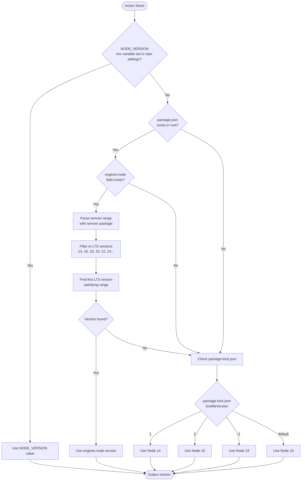

# Overview

This action determines which Node.js version to use in your workflow. It's designed for use in centralized workflows where users need to control Node.js versions from their repository without modifying the workflow.

Maintainers can specify Node.js version via repository variable or `package.json` and `engines.node` value.

## How It Works



The action checks for Node.js version in this order:

1. **`node-version` input** (typically from `NODE_VERSION` repository variable) (highest priority)
2. **`engines.node` field in `package.json`**
3. **`package-lock.json` version** (fallback for backward compatibility)

## Usage

```yaml
- name: Get Node version
  uses: asyncapi/.github/.github/actions/get-node-version-from-package-lock@master
  with:
    node-version: ${{ vars.NODE_VERSION }}
  id: nodeversion

- name: Setup Node.js
  uses: actions/setup-node@v4
  with:
    node-version: ${{ steps.nodeversion.outputs.version }}
```

## How to Control Node.js Version

Users have two options to specify their desired Node.js version:

### Option 1: Repository Variable (Easiest)

Set a `NODE_VERSION` repository variable in GitHub:
1. Go to repository **Settings → Secrets and variables → Actions → Variables tab**
2. Click **New repository variable**
3. Name: `NODE_VERSION`
4. Value: `20` or `22` or any Node.js major version
5. Click **Add variable**

### Option 2: package.json engines field

Add the `engines.node` field to `package.json` with a semver range:

```json
{
  "name": "my-project",
  "version": "1.0.0",
  "engines": {
    "node": ">=20.0.0"
  }
}
```

The action uses the **semver** package to properly parse complex version ranges and automatically selects the **highest even-numbered (LTS) major version** that satisfies the range:

- `>=20.0.0` → `20`
- `>=18.0.0 <22` → `18`
- `>=18.10.3 <22` → `18`
- `20.x` → `20`

**Note:** The action only considers LTS versions (even major numbers: 14, 16, 18, 20, 22, 24, etc.) and returns the major version number. The `actions/setup-node` action will automatically select the appropriate patch version.

## Outputs

| Output | Description |
|--------|-------------|
| `version` | Node.js version number to use with `actions/setup-node` |