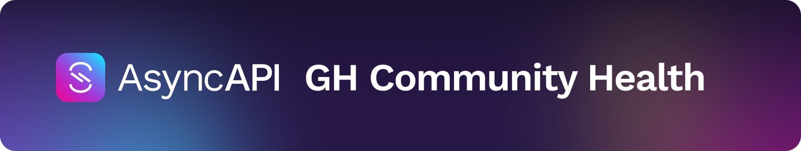

<h1 align="center">
   
  
</h1>

The purpose of this repository is to keep all the community health files that we would normally have to duplicate in each repository. These are global community files that apply to repositories that do not have their own files.

Below is a list of workflows with their corresponding topics and descriptions. By including each topic in your repository in AsyncAPI organisation, you will subscribe to get a workflow or a group of workflows that perform a specific task.

| Topic to include | Workflows you will get | Description |
| --- | --- | --- |
| `get-workflows-validation` | [validate-workflow-schema](.github/workflows/validate-workflow-schema.yml) | Validates the YAML schema of a workflow files in your repository 
| `golang` | [if-go-pr-testing](.github/workflows/if-go-pr-testing.yml) | Compiles and tests Go code using multiple versions of Go
| `nodejs` | [if-nodejs-pr-testing](.github/workflows/if-nodejs-pr-testing.yml) | Builds and tests Node.js projects using multiple Node.js versions
| `get-global-node-release-workflows` | [if-nodejs-release](.github/workflows/if-nodejs-release.yml), [if-nodejs-version-bump.yml](.github/workflows/if-nodejs-version-bump.yml) , [bump.yml](.github/workflows/bump.yml) | Fetches and publishes Node.js release information to the project's website
| `get-global-releaserc` | [.releaserc](.github/workflows/.releaserc) | Fetches release configuration files from a remote repository and makes them available to other workflows 
| `get-global-docs-autoupdate` | [update-docs-on-docs-commits](.github/workflows/update-docs-on-docs-commits.yml) | Updates the documentation of a project using `generate:assets` command (if it exists) when the commit starts with `docs:`